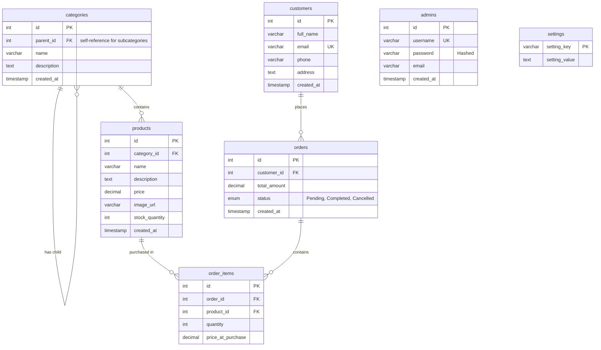

# Urban Style E-Commerce Store

Urban Style is a modern, responsive e-commerce web application featuring a client-facing storefront and a comprehensive back-end administrative dashboard. Designed with premium aesthetics, the platform provides seamless browsing, intuitive shopping cart operations, streamlined checkout processes, and administrative controls for managing inventory, categories, settings, and orders.

---

## 🚀 Technology Stack

- **Frontend Styling:** [Tailwind CSS CDN](https://tailwindcss.com/) with customized color palettes + Vanilla CSS for animations and layout extensions.
- **Frontend Interactivity:** Vanilla JavaScript (ES6) for DOM manipulations, session updates, and client side interactions.
- **Backend Core:** PHP (Procedural architecture utilizing mysqli extension) for session handling, request management, database queries, and administrative controls.
- **Database Engine:** MySQL for relational schema management, transactions, and relational constraints.
- **Local Dev Server:** XAMPP (Apache + MySQL).

---

## 📦 Directory Structure

```text
E-Commerce/
├── admin/                     # Administration Dashboard Area
│   ├── includes/              # Admin layouts (header, footer, authorization check)
│   │   ├── auth.php           # Middleware checking session log status
│   │   ├── footer.php         # Admin dashboard footer layout
│   │   └── header.php         # Admin sidebar and topnav layout
│   ├── categories.php         # Category CRUD management
│   ├── index.php              # Dashboard overview & analytics widgets
│   ├── login.php              # Admin login page with glassmorphic design
│   ├── logout.php             # Admin sign-out route and session cleanup
│   ├── orders.php             # Manage & view customer orders and status updates
│   ├── products.php           # Add, edit, remove products and manage inventory
│   └── settings.php           # Live storefront hero configurations and CMS
├── assets/                    # Static Assets
│   ├── css/
│   │   └── style.css          # Custom styling variables and hover transitions
│   ├── images/                # Dynamically uploaded and static storefront media
│   └── js/
│       └── script.js          # Shared helper scripts (e.g. mobile toggle)
├── config/                    # Configurations
│   └── database.php           # Main database driver and active session initialization
├── database/                  # SQL Schemas & Database Migration Seeders
│   ├── add_admins_table.php   # Table creation and default admin seeder
│   ├── schema.sql             # Primary database tables & sample data definitions
│   ├── settings.sql           # Storefront CMS settings variables table & seeders
│   └── update_categories_table.php # Alters categories table for subcategories support
├── cart.php                   # Shopping Cart UI & calculations page
├── cart_action.php            # Cart operations controller (Add, Update, Remove)
├── checkout.php               # Customer billing and checkout form
├── checkout_process.php       # Transaction processing, stock reduction, & database logging
├── index.php                  # Storefront homepage featuring customizable dynamic hero banner
├── order_success.php          # Invoice details page after completing payment process
├── product_details.php        # Detailed product view showing price, description, & availability
└── products.php               # Complete catalog with recursive subcategory sidebar filtering
```

---

## 🗄️ Database Architecture

Below is the Entity-Relationship (ER) model showing how customers, orders, categories, and products are mapped inside the system.



---

## ✨ System Features

### 🛒 Customer Storefront
1. **Dynamic Homepage:** Custom graphics and dynamic titles editable directly via the Admin panel.
2. **Category & Subcategory Sidebar:** Displays a recursive hierarchy tree of parent categories and child subcategories. Filtering a parent category dynamically includes products from all its children.
3. **Product Inventory Check:** Customers are notified of live stock levels, and cannot order beyond the store's current stock limits.
4. **Persistent Shopping Cart:** Powered by PHP `$_SESSION` arrays, tracking items and quantities seamlessly as the customer shops.
5. **Checkout Script:** Atomic database entries linking the client profile, their orders, and ordered items list while simultaneously decrementing stock quantities.

### 🛡️ Admin Dashboard
1. **Analytics Summary:** Quick summaries indicating overall performance metrics (total products, orders placed, and unique customer profiles).
2. **Recent Feed:** Displays a chronological log of orders with their status updates.
3. **Recursive Inventory & Categories System:** Allows adding/modifying categories and nesting them inside parent categories.
4. **CMS Storefront Configurator:** An interface to update the hero section background image, titles, subtitle text, and fonts on the fly.
5. **Order Dispatching Control:** Allows viewing order forms and client addresses, with status transitions (Pending ➡️ Completed ➡️ Cancelled).
6. **Authentication & Session Regeneration:** Secure login procedures featuring `password_verify` checks and session identifier regeneration to mitigate session fixation attacks.

---

## 🔧 Installation & Setup

### Prerequisites
- [XAMPP](https://www.apachefriends.org/index.html) or equivalent PHP (v7.4 - v8.2) & MySQL stack.

### Step-by-Step Deployment
1. **Clone/Copy Project:** Move this repository directory into your web server root (e.g., `C:\xampp\htdocs\E-Commerce`).
2. **Launch Apache & MySQL:** Open the XAMPP Control Panel and start both services.
3. **Create Database:** 
   - Open your browser and navigate to `http://localhost/phpmyadmin`.
   - Create a database named `urban_style_store`.
4. **Import Schema:**
   - Select the `urban_style_store` database.
   - Click the **Import** tab.
   - Choose `database/schema.sql` and click **Go**.
   - Choose `database/settings.sql` and click **Go**.
5. **Run Setup/Migration Scripts:**
   - Execute the schema migration and admin creation script in your browser or CLI to update category fields and seed administrator credentials:
     - Open `http://localhost/E-Commerce/database/add_admins_table.php` to seed the admin account.
     - Open `http://localhost/E-Commerce/database/update_categories_table.php` to upgrade categories.
6. **Configure DB Driver (Optional):**
   - If your local database uses a username other than `root` or contains a password, edit configurations in `config/database.php`:
     ```php
     $host = 'localhost';
     $username = 'root';
     $password = 'YOUR_DB_PASSWORD';
     $database = 'urban_style_store';
     ```

### Default Credentials
To access the Admin Control Panel (`http://localhost/E-Commerce/admin/`):
- **Username:** `admin`
- **Password:** `admin123`
# E-Commerce_Assignment_24180-2024

