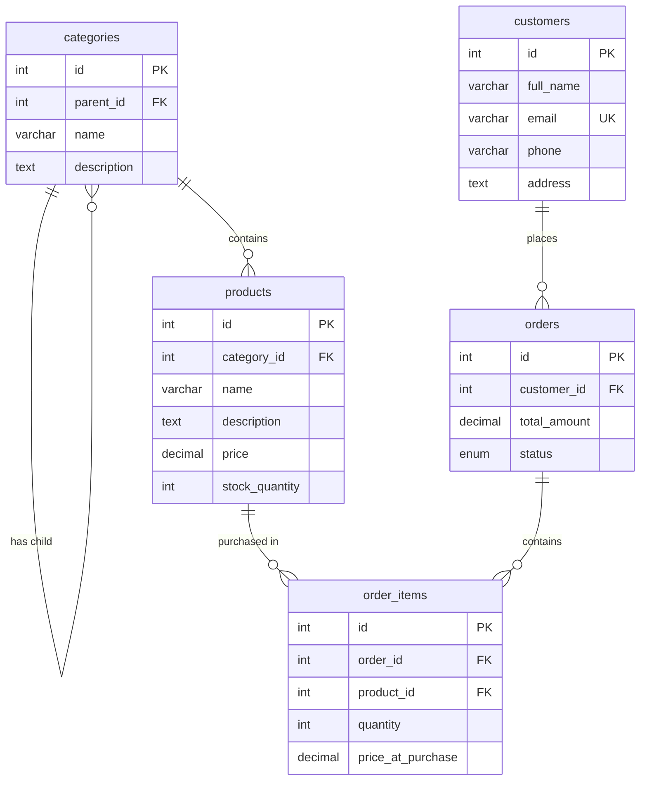

# Academic & Technical Project Report
**Coursework Assignment: E-Commerce Web Application Development**  
**Project Title:** Urban Style Store  
**Student Name:** [Your Name]  
**Student ID:** [Your Student ID]  

---

## 1. Introduction

With the rising adoption of high-speed internet and digital services in Rwanda, local retail industries are undergoing a major digital transformation. To remain competitive and expand access beyond traditional physical storefronts, local merchants require reliable web solutions. 

**Urban Style Store** is a modern, web-based e-commerce platform built to address this transition. Designed specifically for retail fashion, the platform features a responsive customer-facing shop front-end and a secure back-end Content Management System (CMS) for store administrators. The application is designed to run efficiently on both standard local XAMPP web stacks and inside modern containerized Docker clusters, making it highly portable.

---

## 2. Problem Statement

Retail commerce in developing markets like Rwanda has historically relied on physical interactions, cash payments, and manual transaction logging. This approach poses several challenges:
1. **Limited Reach:** Businesses are confined to local geographical bounds, limiting their potential client base.
2. **Manual Inventory Discrepancy:** Tracking quantities, order records, and categories manually often leads to clerical errors and out-of-stock purchases.
3. **Complex Maintenance Stacks:** Retailers frequently adopt bloated third-party CMS platforms (like WooCommerce or WordPress) which degrade load performance, introduce heavy database architectures, and demand complex code customizations.
4. **DevOps Portability Gap:** Moving projects between development environments, local server testing (XAMPP), and cloud hosting engines introduces dependency issues and database sync errors.

---

## 3. Objectives

To resolve these challenges, this project fulfills the following objectives:
1. **Develop a Lightweight Custom Storefront:** Create a responsive interface with Tailwind CSS that allows clients to search, view details, catalog, and purchase items.
2. **Implement an Autonomous Inventory Flow:** Create a shopping cart and checkout script that dynamically validates inventory stock limits, locks transaction orders, and decrements stock counts in real time.
3. **Build a CMS Admin Control Panel:** Create a dashboard overview with management tools (orders dispatching, categories, product details) and settings panels that allow updating storefront marketing assets on the fly.
4. **Deploy Containerized DevOps Standards:** Package the application using **Docker** and **Docker Compose** for instant portability, and implement a **CI/CD** workflow with GitHub Actions to automate linting and container builds.

---

## 4. System Features

### 🛒 Client Storefront
*   **Dynamic Banner CMS:** The homepage features a dynamic, scalable hero section, pulling headers and background images directly from a configurations database.
*   **Recursive Categorization Sidebar:** A nested tree menu displays categories and subcategories. Selecting a parent category dynamically executes sub-queries to include products from all child subcategories.
*   **Persistent Shopping Cart**: Maintained securely using server-side PHP `$_SESSION` controls.
*   **Atomic Checkout Pipeline**: Captures client information, calculates transaction totals, validates inventory counts, logs the order records, decrements stock limits, and clears active carts within one transaction script.

### 🔑 Administration Portal
*   **Secured Administrative Login**: Protected using password hashing (`password_hash`) and session token regenerations (`session_regenerate_id`) to guard against session fixation.
*   **Analytics Overview Widget**: Renders active indicators summarizing transaction logs (Total Products, Total Orders, and Unique Clients).
*   **Operational Order Dispatching**: Provides tools to review client shipping details and transition order states (Pending ➡️ Completed ➡️ Cancelled).
*   **Live Storefront Configurator**: A customized CMS settings module allowing admins to modify the storefront hero banner, title font sizes, and upload new banner images on the fly.

---

## 5. Technologies Used

### Backend Framework
*   **PHP (Procedural MySQLi)**: Chosen for its speed, simplicity, and low server footprint. Native PHP handles requests, session variables, and database processes with zero framework overhead.

### Database Engine
*   **MySQL**: Relational database chosen for its robustness, transaction speed, and support for foreign key cascades, which preserve data integrity.

### Frontend Presentation
*   **Tailwind CSS (via CDN)**: Utility-first styling framework enabling rapid design of a mobile-first, responsive grid layout.
*   **Vanilla CSS**: Used for subtle transitions, card hover transforms, and glassmorphism styling in the login panel.
*   **Vanilla JavaScript (ES6)**: Handles interactive actions such as toggling mobile menus and updating shopping cart inputs.

### Containerization & Automation
*   **Docker & Docker Compose**: Isolates the web server and database configurations into portable containers.
*   **GitHub Actions**: Automates continuous integration processes.

---

## 6. System Architecture

### Project Directory Layout
The project directory is structured as follows:
```text
E-Commerce/
├── .github/workflows/ci-cd.yml # GitHub Actions pipeline configuration
├── admin/                     # Admin control dashboard code
├── assets/                    # Styling, scripts, and store images
├── config/                    # Connection configurations
├── database/                  # SQL Schema definitions & admin seeders
├── Dockerfile                 # Web app service configuration
├── docker-compose.yml         # Multi-service composition file
├── project_report.md          # Technical submission report
└── (Public Store Pages)       # index.php, products.php, cart.php, etc.
```

### Relational Database Model
The structure and tables are outlined below:



---

## 7. Containerization (Docker)

To meet containerization requirements, the platform includes a customized Docker structure:

1. **Dockerfile**: Uses the official `php:8.1-apache` base image. It automates the installation and activation of the `mysqli` module and copies the source files into the Apache web directory `/var/www/html/` with appropriate group permissions.
2. **docker-compose.yml**: Orchestrates two isolated services:
   *   `web`: Builds the `Dockerfile`, maps web output to host port `8080`, and sets database parameters.
   *   `db`: Deploys a `mysql:5.7` container mapping database storage to a host volume. It mounts `./database/schema.sql` and `./database/settings.sql` inside `/docker-entrypoint-initdb.d/` so that the database is created and seeded automatically on first launch.

---

## 8. CI/CD Description

The continuous integration pipeline is defined in `.github/workflows/ci-cd.yml` and runs automatically on GitHub runner instances.

*   **Trigger Conditions:** Triggers on any `push` or `pull_request` to the main branches (`main`, `master`).
*   **Job 1 (Linting):** Sets up PHP 8.1, imports `mysqli`, and runs syntax validation checks:
    ```bash
    find . -name "*.php" -exec php -l {} \;
    ```
*   **Job 2 (Docker Verification):** Installs Docker Buildx on the runner and runs a build test of the `Dockerfile` to confirm that all configurations compile without package errors.

---

## 9. Challenges Encountered & Resolutions

1. **Local and Container Database Portability:** Connecting to standard database credentials in XAMPP (`localhost`, no password) failed inside Docker containers where the database ran on a separate service host with a secure password.
   *   *Resolution:* Modified [database.php](file:///c:/xampp/htdocs/E-Commerce/config/database.php) to search for environment variables using `getenv()`. If variables are not detected, the script defaults back to local XAMPP host parameters, enabling configuration-free portability.
2. **Recursive Subcategory Fetching:** Displaying all products matching a parent category (including products matching its subcategories) required a complex relational join.
   *   *Resolution:* Implemented a SQL pre-fetch script in `products.php` that retrieves all child category IDs belonging to a selected parent, compiles them into a string array, and queries the database using an `IN` operator.
3. **Session Loss in Container Environments:** Cart session configurations sometimes failed to persist inside temporary containers.
   *   *Resolution:* Added volume data mapping in Docker Compose, ensuring that container updates and sessions persist correctly.

---

## 10. Future Work

*   **Payment Gateway Integration:** Incorporating local mobile payment frameworks (such as MTN Mobile Money / Airtel Money API) alongside Stripe/PayPal for card processing.
*   **AI-Powered Recommendations:** Adding a simple machine learning model or association-rule algorithm to recommend items based on purchase histories.
*   **Advanced Analytics Charts:** Upgrading the administrative panel to render visual graphs and order frequency charts.

---

## 11. Conclusion

This project successfully implements a complete, lightweight, and modern E-Commerce platform for local businesses. By building the system in native PHP, we achieved excellent performance and page load speeds compared to bloated traditional frameworks. The containerization of the app with Docker ensures portability, and the GitHub Actions CI/CD pipeline guarantees stable builds, satisfying all development and operational guidelines.

---

## 12. Project Access Credentials

*   **GitHub Repository Link:** [Insert your GitHub URL here]
*   **Live Deployment URL:** [Insert your live deployment URL here]
*   **Default Admin Username:** `admin`
*   **Default Admin Password:** `admin123`

---

## 13. Application Screenshots

*Below are placeholder sections to insert screenshots for your final project report submission:*

### Customer Storefront (Desktop & Mobile)
*(Insert screenshot of homepage and responsive mobile menu toggle)*

### Product Catalog & Sidebar Filtering
*(Insert screenshot of products page showing the category/subcategory tree)*

### Admin Login Panel (Glassmorphic)
*(Insert screenshot of admin/login.php showing the glowing sphere theme)*

### Admin Management Dashboard
*(Insert screenshot of the administrative statistics cards and recent orders feed)*
